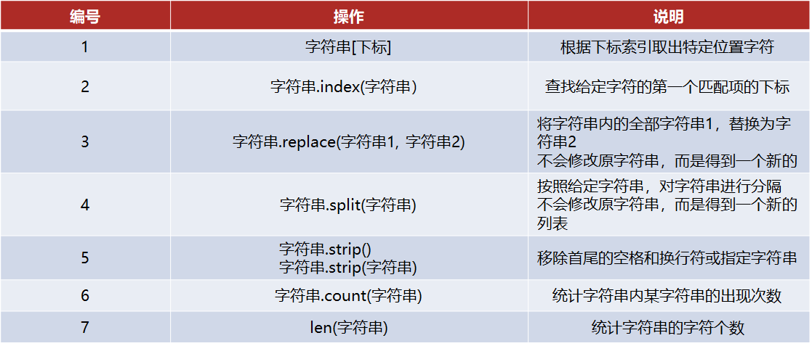
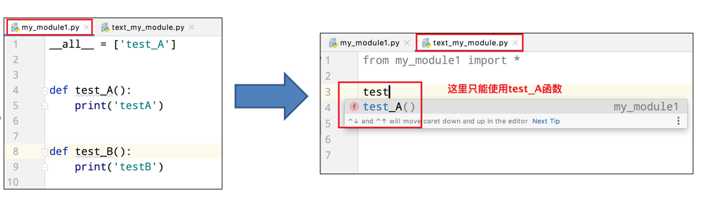

# Python学习

## 字面量：

在代码中，被写下来的的固定的值，称之为字面量

Python有6种值（数据）的类型

  

类型转换
  

## 标识符

### 标识符命名规则

- Python中，标识符命名的规则主要有3类：
    - 内容限定
    - 大小写敏感
    - 不可使用关键字

- 标识符命名规则 - 内容限定
    - 标识符命名中，只允许出现：
        - 英文
        - 中文
        - 数字
        - 下划线（_）
    - 这四类元素。
    - 其余任何内容都不被允许。

- 我们目前只接触到了：变量。所以，目前学习：变量的命名规范。
    - 见名知意
    - 下划线命名法
    - 英文字母全小写

## 运算符

  

### 赋值运算符

  

### 复合赋值运算符

  


## 字符串高级

### 字符串的三种定义方式

- 字符串在Python中有多种定义形式：
    - 单引号定义法：
    - 双引号定义法：
    - 三引号定义法：

>三引号定义法，和多行注释的写法一样，同样支持换行操作。
使用变量接收它，它就是字符串
不使用变量接收它，就可以作为多行注释使用。

**字符串的引号嵌套**

- 如果我想要定义的字符串本身，是包含：单引号、双引号自身呢？如何写？
    - 单引号定义法，可以内含双引号
    - 双引号定义法，可以内含单引号
    - 可以使用转义字符（\）来将引号解除效用，变成普通字符串

### 字符串拼接

如果我们有两个字符串（文本）字面量，可以将其拼接成一个字符串，通过+号即可完成

**字符串无法和非字符串变量进行拼接**

因为类型不一致，无法接上.
就像接力赛一样，不是队友，不能接力的哦

### 字符串格式化

我们可以通过如下语法，完成字符串和变量的快速拼接。
  

>其中的，%s 
%  表示：我要占位
s   表示：将变量变成字符串放入占位的地方
所以，综合起来的意思就是：我先占个位置，等一会有个变量过来，我把它变成字符串放到占位的位置

<br>

**那，数字类型呢？可以不可以占位？**

那必须可以，我们来尝试如下代码：

  

>数字也能用%s占位吗？
可以的哦，这里是将数字 转换成了 字符串哦
也就是数字57，变成了字符串"57"被放入占位的地方

**多个变量占位
变量要用括号括起来
并按照占位的顺序填入**

1. 字符串格式化的语法?
    - "%占位符" % 变量
2. 常用占位符有哪3个？
    - 字符串：  %s
    - 整数:     %d
    - 浮点数:   %f

### 格式化的精度控制

浮点数19.99，变成了19.990000输出,
这里我们就要了解一下，字符串格式化之“数字精度控制”

- **我们可以使用辅助符号"m.n"来控制数据的宽度和精度**
    - m，控制宽度，要求是数字（很少使用）,设置的宽度小于数字自身，不生效
    - .n，控制小数点精度，要求是数字，会进行小数的四舍五入
- 示例：
    - %5d：表示将整数的宽度控制在5位，如数字11，被设置为5d，就会变成：[空格][空格][空格]11，用三个空格补足宽度。
    - %5.2f：表示将宽度控制为5，将小数点精度设置为2小数点和小数部分也算入宽度计算。如，对11.345设置了%7.2f 后，结果是：[空格][空格]11.35。2个空格补足宽度，小数部分限制2位精度后，四舍五入为 .35
    - %.2f：表示不限制宽度，只设置小数点精度为2，如11.345设置%.2f后，结果是11.35

### 字符串格式化 - 快速写法

**通过语法：f"内容{变量}"的格式来快速格式化**

```python
name = "tql"
age = 22
height = 188.99
print(f"我是{name},年龄{age},身高{height}")
```
输出
>我是tql,年龄22,身高188.99

- 这种方式：
    - 不理会类型
    - 不做精度控制
    - 适合对精度没有要求的时候快速使用

### 字符串格式化 - 表达式的格式化

1. 表达式是什么？
    - 表达式就是一个具有明确结果的代码语句，如 1 + 1、type(“字符串”)、3 * 5等
    - 在变量定义的时候，如 age = 11 + 11，等号右侧的就是表达式，也就是有具体的结果，将结果赋值给了等号左侧的变量
2. 如何格式化表达式？
    - f"{表达式}"
    - "%s\%d\%f" % (表达式、表达式、表达式）


```python
print("1*1结果是%d" %(1+1))
print(f"1*1的结果是{1*1}")
print("字符串在python中类型是%s" %type(""))
```
>输出:
1\*1结果是2
1\*1的结果是1
字符串在python中类型是\<class 'str'>

## input语句（函数）

- 在Python中，与之对应的还有一个input语句，用来获取键盘输入。
    - 数据输出：print
    - 数据输入：input
- 使用上也非常简单：
    - 使用input()语句可以从键盘获取输入
    - 使用一个变量接收（存储）input语句获取的键盘输入数据即可

```python
name = input()
```

无论键盘输入何种类型的数据,
最终的接收到的结果都是：字符串类型的数据

## 判断语句

- 布尔类型的字面量：
    - True  表示真（是、肯定）
    - False 表示假 （否、否定）

<br>

- 比较运算符


### if

- if语句的基本格式
```python
if 要判断的条件:
    条件成立时要做的事
elif 条件2:
    条件成立时要做的事
elif 条件3:
    条件成立时要做的事
else:
    所有条件都不成立时要做的事
```
- if语句的注意事项：
    - 判断条件的结果一定要是布尔类型
    - 不要忘记判断条件后的： 引号
    - 归属于if语句的代码块，需在前方填充4个空格缩进
    - elif可以写多个
    - 判断是互斥且有序的，上一个满足后面的就不会判断了
    - 可以在条件判断中，直接写input语句，节省代码量

```python
if int(input("请输入你的身高")) < 120:
    print(1)
elif int(input("请输入其他人身高")) < 150 :
    print(2)
else:
    print(3)
```

### 判断的嵌套

- 嵌套判断语句可以用于多条件、多层次的逻辑判断
- 嵌套判断语句可以根据需求，自由组合if elif else来构建多层次判断
- 嵌套判断语句，一定要注意空格缩进，Python通过空格缩进来决定层次关系

```python
if int(input("请输入你的身高")) < 120:
    print(1)
    if int(input("请输入其他人身高")) == 130:
        print(1.3)
elif int(input("请输入3")) < 150 :
    print(2)
else:
    print(3)
```

## 循环语句

### while循环

```python
i = 0
while i <= 100:
    print(i)
    i += 1
```

while循环注意点
1. while的条件需得到布尔类型，True表示继续循环，False表示结束循环
2. 需要设置循环终止的条件，如i += 1配合 i < 100，就能确保100次后停止，否则将无限循环
3. 空格缩进和if判断一样，都需要设置

**循环嵌套**

- 同判断语句的嵌套一样，循环语句的嵌套，要注意空格缩进。
- 基于空格缩进来决定层次关系
- 注意条件的设置，避免出现无限循环（除非真的需要无限循环）

### for循环

#### 基础语法

- 除了while循环语句外，Python同样提供了for循环语句。
- 两者能完成的功能基本差不多，但仍有一些区别：
    - while循环的循环条件是自定义的，自行控制循环条件
    - for循环是一种”轮询”机制，是对一批内容进行”逐个处理”

```python
for 临时变量 in 待处理数据集
    循环体
```

<br>

遍历字符串:
```python
# 定义字符串name
name = ”itheima”
# for循环处理字符串
for x in name: 
       print(x)
```
>可以看出，for循环是将字符串的内容：依次取出 
所以，for循环也被称之为：遍历循环

- for循环注意点
    - 同while循环不同，for循环是无法定义循环条件的。
    - 只能从被处理的数据集中，依次取出内容进行处理。
    - 所以，理论上讲，Python的for循环无法构建无限循环（被处理的数据集不可能无限大）

#### range语句

```python
for 临时变量 in 待处理数据集(可迭代对象): 
        循环满足条件时执行的代码
```

- 语法中的：待处理数据集，严格来说，称之为：可迭代类型
- 可迭代类型指，其内容可以一个个依次取出的一种类型，包括：
    - 字符串
    - 列表
    - 元组
    - 等

range语句，获得一个简单的数字序列（可迭代类型的一种）:
```python
语法1：
range(num)
```
>获取一个从0开始，到num结束的数字序列（不含num本身） 
如range(5)取得的数据是：[0, 1, 2, 3, 4]


```python
语法2：
range(num1,num2)
```
>获得一个从num1开始，到num2结束的数字序列（不含num2本身）
如，range(5, 10)取得的数据是：[5, 6, 7, 8, 9]

```python
语法3：
range(num1, num2, step)
```
>获得一个从num1开始，到num2结束的数字序列（不含num2本身）
数字之间的步长，以step为准（step默认为1）
如，range(5, 10, 2)取得的数据是：[5, 7, 9]

**for循环遍历range序列**

```python
# for循环处理字符串
for i in range(5): 
       print(i)
```

#### 变量作用域

```python
for 临时变量 in 待处理数据集
    循环体
```
- 临时变量，在编程规范上，作用范围（作用域），只限定在for循环内部
- 如果在for循环外部访问临时变量：
    - 实际上是可以访问到的
    - 在编程规范上，是不允许、不建议这么做的
- 如果实在需要在循环外访问循环内的临时变量，可以在循环外预先定义

**for循环嵌套**

- 和while循环一样，需要注意缩进,因为通过缩进，确定层次关系
- for循环和while循环可以相互嵌套使用

### continue和break

1. continue的作用是：
    - 中断所在循环的当次执行，直接进入下一次
2. break的作用是：
    - 直接结束所在的循环
3. 注意事项：
    - continue和break，在for和while循环中作用一致
    - 在嵌套循环中，只能作用在所在的循环上，无法对上层循环起作用

## 函数

1. 函数是：
    - 组织好的、可重复使用的、用来实现特定功能的代码段
2. 使用函数的好处是：
    - 将功能封装在函数内，可供随时随地重复利用
    - 提高代码的复用性，减少重复代码，提高开发效率

**函数的定义：**

```python
def 函数名(传入参数):
    函数体
    return 返回值
```

**函数的调用：**

```python
函数名(参数)
```

**注意:**
① 参数如不需要，可以省略（后续章节讲解）
② 返回值如不需要，可以省略（后续章节讲解）
③ 函数必须先定义后使用

- 函数定义中的参数，称之为形式参数
- 函数调用中的参数，称之为实际参数
- 函数的参数数量不限，使用逗号分隔开
- 传入参数的时候，要和形式参数一一对应，逗号隔开

**None类型**

如果函数没有使用return语句返回数据，那么函数有返回值吗？  
实际上是：有的。

Python中有一个特殊的字面量：None，其类型是：<class 'NoneType'>  
无返回值的函数，实际上就是返回了：None这个字面量

None表示：空的、无实际意义的意思   
函数返回的None，就表示，这个函数没有返回什么有意义的内容。  
也就是返回了空的意思。

**函数的说明文档**

函数是纯代码语言，想要理解其含义，就需要一行行的去阅读理解代码，效率比较低。

我们可以给函数添加说明文档，辅助理解函数的作用。
语法如下：

```python
def func(x,y)
    """
    函数说明
    :param x : 形参x的说明
    :param y : 形参y的说明
    :return : 返回值的说明
    """

    函数体
    return 返回值
```

通过多行注释的形式，对函数进行说明解释

内容应写在函数体之前

在PyCharm编写代码时，可以通过鼠标悬停，查看调用函数的说明文档

  

嵌套调用:和Java一样

**局部变量和全局变量  
global关键字**

使用 global关键字 可以在函数内部声明变量为全局变量, 如下所示

```python
num = 100


def test_a():
    print(num)


def test_b():
    global num
    num = 200
    print(num)


if __name__ == '__main__':
    test_a()
    test_b()
    print(num)

out:
    100
    200
    200
```

## 数据容器

Python中的数据容器：  
一种可以容纳多份数据的数据类型，容纳的每一份数据称之为1个元素  
每一个元素，可以是任意类型的数据，如字符串、数字、布尔等。

- 数据容器根据特点的不同，如：
  - 是否支持重复元素
  - 是否可以修改
  - 是否有序，等
- 分为5类，分别是：
**列表（list）、元组（tuple）、字符串（str）、集合（set）、字典（dict）**

### 列表

基本语法:

```python
#字面量
[元素1,元素2,元素3,元素4...]

#定义变量
变量名称 = [元素1,元素2,元素3,元素4...]

#定义空列表
变量名称 = []
变量名称 = list()
```

定义方式:

  

注意：列表可以一次存储多个数据，且可以为不同的数据类型，支持嵌套

下标索引:

单层下标和Java一样

如果列表是嵌套的列表，同样支持下标索引

```python
## 2层嵌套list
my_list = [[1, 2, 3], [4, 5, 6]]

## 获取内层第一个list
print(my_list[0])   # [1, 2, 3]

# 获取内层第一个list的第一个元素
print(my_list[0][0])    # 1
```

**函数是一个封装的代码单元，可以提供特定功能。  
在Python中，如果将函数定义为class（类）的成员，那么函数会称之为：方法**

```python
class Student:

    def add(self, x, y):
        return x + y


s = Student()
num = s.add(1, 2)
print(num)

```

查找某元素的下标

    语法：列表.index(元素)


```python
## 2层嵌套list
my_list = [[1, 2, 3], [4, 5, 6]]
my_list1 = [1, 2, 3]


print(my_list1.index(1))    # 0
print(my_list.index(1))     #报错ValueError: 1 is not in list
```

修改特定位置（索引）的元素值：

     语法：列表[下标] = 值

插入元素：

     语法：列表.insert(下标, 元素)，在指定的下标位置，插入指定的元素

追加元素：
     
     语法：列表.append(元素)，将指定元素，追加到列表的尾部

追加元素方式2：
     
     语法：列表.extend(其它数据容器)，将其它数据容器的内容取出，依次追加到列表尾部

删除元素：
     
     语法1： del 列表[下标]
     语法2：列表.pop(下标)


删除某元素在列表中的第一个匹配项
     
     语法：列表.remove(元素)

清空列表内容，
    
    语法：列表.clear()

统计某元素在列表内的数量
    
    语法：列表.count(元素)


统计列表内，有多少元素
     
     语法：len(列表)
     可以得到一个int数字，表示列表内的元素数量

  

- 经过上述对列表的学习，可以总结出列表有如下特点：
  - 可以容纳多个元素（上限为2**63-1、9223372036854775807个）
  - 可以容纳不同类型的元素（混装）
  - 数据是有序存储的（有下标序号）
  - 允许重复数据存在
  - 可以修改（增加或删除元素等）

#### 列表的遍历

while循环遍历:

```python
list1 = [1, 2, 3, 4, 5, 6]

index = 0
while index < len(list1):
    print(list1[index])
    index += 1
```

for循环遍历:  
对比while，for循环更加适合对列表等数据容器进行遍历。

```python
list1 = [1, 2, 3, 4, 5, 6]

for i in list1:
    print(i)
```

### tuple元组

**元组一旦定义完成，就不可修改**

所以，当我们需要在程序内封装数据，又不希望封装的数据被篡改，那么元组就非常合适了

  

  

元组由于不可修改的特性，所以其操作方法非常少。

- 元组的相关操作 - 注意事项
  - 不可以修改元组的内容，否则会直接报错
  - 可以修改元组内的list的内容（修改元素、增加、删除、反转等）
  - 不可以替换list为其它list或其它类型

元组的遍历:和list一样

### 字符串

和其它容器如：列表、元组一样，字符串也可以通过下标进行访问  
从前向后，下标从0开始  
从后向前，下标从-1开始

  


- 同元组一样，字符串是一个：无法修改的数据容器。
- 所以：
  - 修改指定下标的字符	（如：字符串[0] = “a”）
  - 移除特定下标的字符	（如：del 字符串[0]、字符串.remove()、字符串.pop- ()等）
  - 追加字符等		（如：字符串.append()）
- **均无法完成。如果必须要做，只能得到一个新的字符串，旧的字符串是无法修改**

查找特定字符串的下标索引值

     语法：字符串.index(字符串)

字符串的替换
     
     语法：字符串.replace(字符串1，字符串2）
     功能：将字符串内的全部：字符串1，替换为字符串2
     注意：不是修改字符串本身，而是得到了一个新字符串哦

字符串的分割

     语法：字符串.split(分隔符字符串）
     功能：按照指定的分隔符字符串，将字符串划分为多个字符串，并存入列表对象中
     注意：字符串本身不变，而是得到了一个列表对象

```python
str1 = '1234456'
list2 = str1.split('2')
print(list2)    #['1', '34456']
```

字符串的规整操作（去前后空格）

     语法：字符串.strip()

字符串的规整操作（去前后指定字符串）

     语法：字符串.strip(字符串)

```python
str2 = '12tqlnb21'
print(str2.strip("12"))     #tqlnb
```

>注意，传入的是“12” 其实就是：”1”和”2”都会移除，是按照单个字符。

统计字符串中某字符串的出现次数

     语法：字符串.count(字符串)


统计字符串的长度

     语法：len(字符串)
        数字（1、2、3...）
        字母（abcd、ABCD等）
        符号（空格、!、@、#、$等）
        中文
        均算作1个字符

  


字符串的遍历:同列表、元组一样，字符串也支持while循环和for循环进行遍历

- 作为数据容器，字符串有如下特点：
  - 只可以存储字符串
  - 长度任意（取决于内存大小）
  - 支持下标索引
  - 允许重复字符串存在
  - 不可以修改（增加或删除元素等）
  - 支持for循环
- 基本和列表、元组相同
- 不同与列表和元组的在于：字符串容器可以容纳的类型是单一的，只能是字符串类型。
- 不同于列表，相同于元组的在于：字符串不可修改


### 序列

序列是指：内容连续、有序，可使用下标索引的一类数据容器  
列表、元组、字符串，均可以可以视为序列。

序列支持切片，即：列表、元组、字符串，均支持进行切片操作  
切片：从一个序列中，取出一个子序列

- 语法：序列[起始下标:结束下标:步长]
- 表示从序列中，从指定位置开始，依次取出元素，到指定位置结束，得到一个新序列：
  - 起始下标表示从何处开始，可以留空，留空视作从头开始
  - 结束下标（不含）表示何处结束，可以留空，留空视作截取到结尾
  - 步长表示，依次取元素的间隔
    - 步长1表示，一个个取元素
    - 步长2表示，每次跳过1个元素取
    - 步长N表示，每次跳过N-1个元素取
    - 步长为负数表示，反向取（注意，起始下标和结束下标也要反向标记）

>注意，此操作不会影响序列本身，而是会得到一个新的序列（列表、元组、字符串）

```python
my_list = [1, 2, 3, 4, 5]

new_list = my_list[1:4]	# 下标1开始，下标4（不含）结束，步长1
print(new_list)		# 结果：[2, 3, 4]

new_tuple = my_tuple[:]	# 从头开始，到最后结束，步长1
print(new_tuple)		# 结果：(1, 2, 3, 4, 5)

new_list = my_list[::2]		# 从头开始，到最后结束，步长2
print(new_list)		# 结果：[1, 3, 5]

new_str = my_str[:4:2]	# 从头开始，到下标4（不含）结束，步长2
print(new_str)		# 结果："13"

new_str = my_str[::-1]	# 从头（最后）开始，到尾结束，步长-1（倒序）
print(new_str)		# 结果："54321"

new_list = my_list[3:1:-1]	# 从下标3开始，到下标1（不含）结束，步长-1（倒序）
print(new_list)		# 结果：[4, 3]

my_tuple = (1, 2, 3, 4, 5)
new_tuple = my_tuple[:1:-2] 	# 从头（最后）开始，到下标1(不含)结束，步长-2（倒序）
print(new_tuple)		# 结果：(5, 3)
```

### set集合

如果场景需要对内容做去重处理，列表、元组、字符串就不方便了。  
而集合，最主要的特点就是：不支持元素的重复（自带去重功能）、并且内容无序

- 和列表、元组、字符串等定义基本相同：
  - 列表使用：[]
  - 元组使用：()
  - 字符串使用：""
  - 集合使用：{}
  
因为要对元素做去重处理  
所以无法保证顺序和创建的时候一致

首先，因为集合是无序的，所以集合不支持：下标索引访问  
但是集合和列表一样，是允许修改的，所以我们来看看集合的修改方法。

添加新元素

     语法：集合.add(元素)。将指定元素，添加到集合内
     结果：集合本身被修改，添加了新元素

移除元素

     语法：集合.remove(元素)，将指定元素，从集合内移除
     结果：集合本身被修改，移除了元素


从集合中随机取出元素

     语法：集合.pop()，功能，从集合中随机取出一个元素
     结果：会得到一个元素的结果。同时集合本身被修改，元素被移除


清空集合

     语法：集合.clear()，功能，清空集合
     结果：集合本身被清空


取出2个集合的差集

     语法：集合1.difference(集合2)，
     功能：取出集合1和集合2的差集（集合1有而集合2没有的）
     结果：得到一个新集合，集合1和集合2不变

消除2个集合的差集

     语法：集合1.difference_update(集合2)
     功能：对比集合1和集合2，在集合1内，删除和集合2相同的元素。
     结果：集合1被修改，集合2不变

2个集合合并

     语法：集合1.union(集合2)
     功能：将集合1和集合2组合成新集合
     结果：得到新集合，集合1和集合2不变

查看集合的元素数量

     语法：len(集合)
     功能：统计集合内有多少元素
     结果：得到一个整数结果

集合同样支持使用for循环遍历

```python
set1 = {1, 2, 3}
for i in set1:
    print(i)
```

要注意：集合不支持下标索引，所以也就不支持使用while循环。

  


- 集合有如下特点：
  - 可以容纳多个数据
  - 可以容纳不同类型的数据（混装）
  - 数据是无序存储的（不支持下标索引）
  - 不允许重复数据存在
  - 可以修改（增加或删除元素等）
  - 支持for循环

### dict字典/映射

字典的定义，同样使用{}，不过存储的元素是一个个的：键值对，如下语法：

```python
#定义字典字面量
{key: value, key: value, key: value, key: value}
#定义字典变量
my_dict = {key: value, key: value, key: value, key: value}
#定义空字典
my_dict = {}
my_dict = dict()
```

- 使用{}存储原始，每一个元素是一个键值对
- 每一个键值对包含Key和Value（用冒号分隔）
- 键值对之间使用逗号分隔
- Key和Value可以是任意类型的数据（key不可为字典）
- Key不可重复，重复会对原有数据覆盖

**字典常用操作**

新增元素

	语法：字典[Key] = Value，结果：字典被修改，新增了元素

更新元素

	语法：字典[Key] = Value，结果：字典被修改，元素被更新
	注意：字典Key不可以重复，所以对已存在的Key执行上述操作，就是更新Value值

删除元素

	语法：字典.pop(Key)，结果：获得指定Key的Value，同时字典被修改，指定Key的数据被删除

清空字典

	语法：字典.clear()，结果：字典被修改，元素被清空


获取全部的key

	语法：字典.keys()，结果：得到字典中的全部Key

遍历字典

	语法：for key in 字典.keys()

计算字典内的全部元素（键值对）数量

	语法：len(字典)
	结果：得到一个整数，表示字典内元素（键值对）的数量

  

- 字典特点：
  - 可以容纳多个数据
  - 可以容纳不同类型的数据
  - 每一份数据是KeyValue键值对
  - 可以通过Key获取到Value，Key不可重复（重复会覆盖）
  - 不支持下标索引
  - 可以修改（增加或删除更新元素等）
  - 支持for循环，不支持while循环


**数据容器特点对比**

  

### 数据容器的通用功能

**数据容器的通用操作 - 遍历**

数据容器尽管各自有各自的特点，但是它们也有通用的一些操作。  
- 首先，在遍历上：
  - 5类数据容器都支持for循环遍历
  - 列表、元组、字符串支持while循环，集合、字典不支持（无法下标索引）

尽管遍历的形式各有不同，但是，它们都支持遍历操作。

**数据容器通用统计功能**

  

**数据容器通用转换功能**

除了下标索引这个共性外，还可以通用类型转换

list(容器) -- 
将给定容器转换为列表

str(容器) -- 
将给定容器转换为字符串

tuple(容器) -- 
将给定容器转换为元组

set(容器) -- 
将给定容器转换为集合

**数据容器通用排序功能**

sorted(容器, [reverse=True])  
将给定容器进行排序

注意，排序后都会得到列表（list）对象。

  

## 函数进阶

### 函数多返回值

```python
def test_return():
    return 1,2

x, y = test_return()
print(x)
print(y)
```

按照返回值的顺序，写对应顺序的多个变量接收即可  
变量之间用逗号隔开  
支持不同类型的数据return


### 函数多种传参方式

- 使用方式上的不同, 函数有4中常见参数使用方式:
  - 位置参数
  - 关键字参数
  - 缺省参数
  - 不定长参数
  
**位置参数**：调用函数时根据函数定义的参数位置来传递参数

注意：传递的参数和定义的参数的顺序及个数必须一致


**关键字参数**：函数调用时通过“键=值”形式传递参数.

作用: 可以让函数更加清晰、容易使用，同时也清除了参数的顺序需求

```python
def user_info(name, age, gender):
    print(f"你的名字是:{name},年龄是:{age},性别是:{gender}")

# 关键字传参
user_info(name="小明", age=20, gender="男")
# 可以不按固定顺序
user_info(age=20, gender="男", name="小明")
# 可以和位置参数混用,位置参数必须在前,且匹配参数顺序
user_info("小明", age=20, gender="男")
```

注意：函数调用时，如果有位置参数时，位置参数必须在关键字参数的前面，但关键字参数之间不存在先后顺序


**缺省参数**：缺省参数也叫默认参数，用于定义函数，为参数提供默认值，调用函数时可不传该默认参数的值（注意：所有位置参数必须出现在默认参数前，包括函数定义和调用）.  

作用: 当调用函数时没有传递参数, 就会使用默认是用缺省参数对应的值.

```python
def user_info(name, age, gender="男"):
    print(f"你的名字是:{name},年龄是:{age},性别是:{gender}")

user_info(name="小明", age=20, gender="男")
user_info(name="小明", age=20)
```

注意：

       函数调用时，如果为缺省参数传值则修改默认参数值, 否则使用这个默认值

**不定长参数**：不定长参数也叫可变参数. 用于不确定调用的时候会传递多少个参数(不传参也可以)的场景.

作用: 当调用函数时不确定参数个数时, 可以使用不定长参数

不定长参数的类型:

     ①位置传递
     ②关键字传递

**位置传递**

```python
def user_info(*args):
    print(args)

user_info("tom")  # ('tom',)
user_info("123", "tql")  # ('123', 'tql')
```

注意：

      传进的所有参数都会被args变量收集，它会根据传进参数的位置合并为一个元组(tuple)，args是元组类型，这就是位置传递

**关键字传递**

```python
def user_info(**kwargs):
    print(kwargs)

user_info(name="tql", age=1, gender="男")    # {'name': 'tql', 'age': 1, 'gender': '男'}
```

注意：

      参数是“键=值”形式的形式的情况下, 所有的“键=值”都会被kwargs接受, 同时会根据“键=值”组成字典.

### 匿名函数

#### 函数作为参数传递

在前面的函数学习中，我们一直使用的函数，都是接受数据作为参数传入：
数字
字符串
字典、列表、元组等

其实，我们学习的函数本身，也可以作为参数传入另一个函数内。

```python
def add(a, b):
    return a + b

def subtract(a, b):
    return a - b

def math_operation(func, a, b):
    return func(a, b)

print(math_operation(add, 5, 3))    # 输出 8
print(math_operation(subtract, 5, 3))    # 输出 2
```

这是一种，计算逻辑的传递，而非数据的传递。  
就像上述代码那样，不仅仅是相加，相见、相除、等任何逻辑都可以自行定义并作为函数传入。

#### lambda匿名函数

- 函数的定义中
  - def关键字，可以定义带有名称的函数
  - lambda关键字，可以定义匿名函数（无名称）
- 有名称的函数，可以基于名称重复使用。
- 无名称的匿名函数，只可临时使用一次。

<br>

- 匿名函数定义语法：
  - lambda arguments: expression
- 传入参数表示匿名函数的形式参数，如：x, y 表示接收2个形式参数
- 函数体，就是函数的执行逻辑，要注意：只能写一行，无法写多行代码

```python
sum = lambda x, y: x + y
print(sum(3, 5))  # 输出 8
```
>在这个例子中，我们定义了一个Lambda函数，它接受两个参数x和y，并返回它们的和。我们将这个Lambda函数赋值给一个名为sum的变量，并使用它来计算3和5的和。最后，我们使用print语句将结果输出到控制台。

Lambda函数通常用于需要传递函数作为参数的函数中，例如在map()，filter()和reduce()函数中。它们还可以用于编写简单的回调函数。

## 文件操作

### 文件读取

open()打开函数:  
在Python，使用open函数，可以打开一个已经存在的文件，或者创建一个新文件，语法如下

```python
open(name, code, encoding)
```

- name：是要打开的目标文件名的字符串(可以包含文件所在的具体路径)。
- mode：设置打开文件的模式(访问模式)：只读、写入、追加等。
- encoding:编码格式（推荐使用UTF-8）

实例:

```python
f=open("tql.txt","r",encoding="UTF-8")
```

mode常用的三种基础访问模式:


  

**读操作相关方法**

read()方法：

```python
文件对象.read(num)
```

num表示要从文件中读取的数据的长度（单位是字节），如果没有传入num，那么就表示读取文件中所有的数据。

readlines()方法：  
readlines可以按照行的方式把整个文件中的内容进行一次性读取，并且返回的是一个列表，其中每一行的数据为一个元素。

```python
f = open('python.txt')
content = f.readlines()

print(content)

# 关闭文件
f.close()
```
readline()方法：一次读取一行内容

```python
f = open('python.txt')

content = f.readline()
print(f'第一行：{content}')
content = f.readline()
print(f'第二行：{content}')

# 关闭文件
f.close()
```

**for循环读取文件行**

```python
for line in open("python.txt", "r"):
    print(line)     # 每一个line临时变量，就记录了文件的一行数据
```

**close() 关闭文件对象**

```python
f = open("python.txt", "r")

f.close()

# 最后通过close，关闭文件对象，也就是关闭对文件的占用
# 如果不调用close,同时程序没有停止运行，那么这个文件将一直被Python程序占用。
```

**with open 语法**

```python
with open("python.txt", "r") as f:
    f.readlines()

# 通过在with open的语句块中对文件进行操作
# 可以在操作完成后自动关闭close文件，避免遗忘掉close方法
```

  

### 文件写入

```python
# 1. 打开文件
f = open('python.txt', 'w')

# 2.文件写入
f.write('hello world')

# 3. 内容刷新
f.flush()
```

- 注意：
  - 直接调用write，内容并未真正写入文件，而是会积攒在程序的内存中，称之为缓冲区
  - 当调用flush的时候，内容会真正写入文件
  - 这样做是避免频繁的操作硬盘，导致效率下降（攒一堆，一次性写磁盘）

<br>

**写操作注意:**

文件如果不存在，使用”w”模式，会创建新文件  
文件如果存在，使用”w”模式，会将原有内容清空

### 文件追加

```python
# 1. 打开文件，通过a模式打开即可
f = open('python.txt', 'a')

# 2.文件写入
f.write('hello world')

# 3. 内容刷新
f.flush()
```

注意：  
a模式，文件不存在会创建文件  
a模式，文件存在会在最后，追加写入文件

## 异常,模块,包

为什么要捕获异常:

世界上没有完美的程序，任何程序在运行的过程中，都有可能出现：异常，也就是出现bug
导致程序无法完美运行下去。

我们要做的，不是力求程序完美运行。  
而是在力所能及的范围内，对可能出现的bug，进行提前准备、提前处理。

这种行为我们称之为：异常处理（捕获异常）

<hr>

当我们的程序遇到了BUG, 那么接下来有两种情况:

       ① 整个程序因为一个BUG停止运行
       ② 对BUG进行提醒, 整个程序继续运行


捕获异常的作用在于：提前假设某处会出现异常，做好提前准备，当真的出现异常的时候，可以有后续手段。

语法:

```python
try:
    可能发生错误的代码
except:
    如果出现异常执行的代码
```

捕获指定异常

```python
try:
    print(name)
except NameError as e:
    print('name变量名称未定义错误')
```

如果尝试执行的代码的异常类型和要捕获的异常类型不一致，则无法捕获异常。  
一般try下方只放一行尝试执行的代码。


捕获多个异常

当捕获多个异常时，可以把要捕获的异常类型的名字，放到except 后，并使用元组的方式进行书写。


```python
try:
    print(1/0)
except (NameError, ZeroDivisionError):
    print('ZeroDivision错误...')
```

捕获异常并输出描述信息

```python
try:
    print(num)
except (NameError, ZeroDivisionError) as e:
    print(e)
```

捕获所有异常

```python
try:
    print(name)
except Exception as e:
    print(e)
```

异常else

```python
try:
    print(1)
except Exception as e:
    print(e)
else:
    print('我是else，是没有异常的时候执行的代码')
```

异常的finally  
finally表示的是无论是否异常都要执行的代码，例如关闭文件。

```python
try:
    f = open('test.txt', 'r')
except Exception as e:
    f = open('test.txt', 'w')
else:
    print('没有异常，真开心')
finally:
    f.close()
```

### 异常的传递性

```python
def fun1():
    print("1开始")
    1/0
    print("1结束")

def fun2():
    print("2开始")
    fun1()
    print("2结束")

if __name__ == '__main__':
    print("main开始")
    fun2()
    print("main结束")
```

输出:

```python
main开始
2开始
1开始
Traceback (most recent call last):
    ...................
    1/0
ZeroDivisionError: division by zero
```

当所有函数都没有捕获异常的时候, 程序就会报错  
利用异常具有传递性的特点, 当我们想要保证程序不会因为异常崩溃的时候, 
就可以在main函数中设置异常捕获, 由于无论在整个程序哪里发生异常, 最终都
会传递到main函数中, 这样就可以确保所有的异常都会被捕获

### 模块

Python 模块(Module)，是一个 Python 文件，以 .py 结尾.  模块能定义函数，类和变量，模块里也能包含可执行的代码.

模块的作用:  python中有很多各种不同的模块, 每一个模块都可以帮助我
们快速的实现一些功能, 比如实现和时间相关的功能就可以使用time模块
我们可以认为一个模块就是一个工具包, 每一个工具包中都有各种不同的
工具供我们使用进而实现各种不同的功能.


大白话：模块就是一个Python文件，里面有类、函数、变量等，我们可以
拿过来用（导入模块去使用）

#### 模块导入

```python
[from 模块名] import [模块 | 类 | 变量 | 函数 | *] [as 别名]
```

- 常用的组合形式如：
  - import 模块名
  - from 模块名 import 类、变量、方法等
  - from 模块名 import *
  - import 模块名 as 别名
  - from 模块名 import 功能名 as 别名

<hr>

import模块名

```python
import 模块名
import 模块名1，模块名2

模块名.功能名()
```

from 模块名 import 功能名

```python
from 模块名 import 功能名

功能名()
```

```python
# 导入时间模块中的sleep方法
from time import sleep
print("开始")
# 让程序睡眠1秒(阻塞)
sleep(1)
print("结束")
```

from 模块名 import *

```python
from 模块名 import *

功能名()
```

```python
# 导入时间模块中所有的方法
from time import *
print("开始")
# 让程序睡眠1秒(阻塞)
sleep(1)
print("结束")
```

as定义别名

```python
# 模块定义别名
import 模块名 as 别名

# 功能定义别名
from 模块名 import 功能 as 别名
```

```python
# 模块别名
import time as tt
tt.sleep(2)
print('hello')

# 功能别名
from time import sleep as sl
sl(2)
print('hello')
```

#### 自定义模块

注意: 

  每个Python文件都可以作为一个模块，模块的名字就是文件的名字. 也就是说自定义模块名必须要符合标识符命名规则

在实际开发中，当一个开发人员编写完一个模块后，为了让模块能够在项目中达到想要的效果，
这个开发人员会自行在py文件中添加一些测试信息，例如，在my_module1.py文件中添加测试代码test(1,1)

问题: 
此时，无论是当前文件，还是其他已经导入了该模块的文件，在运行的时候都会自动执行`test`函数的调用
解决方案：

```python
def test(a, b):
    print(a + b)

# 只在当前文件中调用该函数，其他导入的文件内不符合该条件，则不执行test函数调用
if __name__ == '__main__':
    test (1, 1)
```

注意事项：当导入多个模块的时候，且模块内有同名功能. 当调用这个同名功能的时候，调用到的是后面导入的模块的功能

**\_\_all__**

如果一个模块文件中有`__all__`变量，当使用`from xxx import *`导入时，只能导入这个列表中的元素

  

### 包

从物理上看，包就是一个文件夹，在该文件夹下包含了一个 __init__.py 文件，该文件夹可用于包含多个模块文件
从逻辑上看，包的本质依然是模块

包的作用: 

     当我们的模块文件越来越多时,包可以帮助我们管理这些模块, 包的作用就是包含多个模块，但包的本质依然是模块

Pycharm中的基本步骤:

[New]   ->   [Python Package]  ->  输入包名  ->  [OK]   ->  新建功能模块(有联系的模块)

注意：新建包后，包内部会自动创建`__init__.py`文件，这个文件控制着包的导入行为

**导包**

方式1:

```python
import 包名.模块名

包名.模块名.目标
```

方式2:

```python
from 包名 import *
模块名.目标
```

注意：必须在`__init__.py`文件中添加`__all__ = []`，控制允许导入的模块列表

  


**第三方包**

我们知道，包可以包含一堆的Python模块，而每个模块又内含许多的功能。
所以，我们可以认为：一个包，就是一堆同类型功能的集合体。

- 在Python程序的生态中，有许多非常多的第三方包（非Python官方），可以极大- 的帮助我们提高开发效率，如：
  - 科学计算中常用的：numpy包
  - 数据分析中常用的：pandas包
  - 大数据计算中常用的：pyspark、apache-flink包
  - 图形可视化常用的：matplotlib、pyecharts
  - 人工智能常用的：tensorflow
  - 等

这些第三方的包，极大的丰富了Python的生态，提高了开发效率。
但是由于是第三方，所以Python没有内置，所以我们需要安装它们才可以导入使用哦。

pip install 包名称

由于pip是连接的国外的网站进行包的下载，所以有的时候会速度很慢。

我们可以通过如下命令，让其连接国内的网站进行包的安装：
pip install -i https://pypi.tuna.tsinghua.edu.cn/simple 包名称

https://pypi.tuna.tsinghua.edu.cn/simple 是清华大学提供的一个网站，可供pip程序下载第三方包


## python面向对象

### 类的定义和使用

```python
class 类名称:
    类的属性/成员变量

    类的行为/成员方法
```

创建对象的语法是

```python
对象 = 类名称()
```

```python
class Student:
    name = None
    age = None

    def say_hi(self):
        print("hi")
```

### 成员方法

成员方法的定义语法

```python
def 方法名(self,形参1,形参2......形参n):
    方法体
```

可以看到，在方法定义的参数列表中，有一个：self关键字  
self关键字是成员方法定义的时候，必须填写的。  
它用来表示类对象自身的意思  
当我们使用类对象调用方法的是，self会自动被python传入  
在方法内部，想要访问类的成员变量，必须使用self  

self关键字，尽管在参数列表中，但是传参的时候可以忽略它。在传入参数的时候，self是透明的，可以不用理会它。

### 构造方法

Python类可以使用：__init__()方法，称之为构造方法。  
可以实现：  
在创建类对象（构造类）的时候，会自动执行。  
在创建类对象（构造类）的时候，将传入参数自动传递给__init__方法使用。

构建类时传入的参数会自动提供给__init__方法
构建类的时候__init__方法会自动执行

```python
class my_class:
    name = None
    age = None
    tel = None

    def __init__(self,name, age, tel):
        self.name = name
        self.age = age
        self.tel = tel
```

在构造方法内定义成员变量，需要使用self关键字

### 魔术方法

上文学习的__init__ 构造方法，是Python类内置的方法之一。  
这些内置的类方法，各自有各自特殊的功能，这些内置方法我们称之为：魔术方法


  


__str__ : 相当于toString()

__eq__ : 相当于equals()

### 封装

**私有成员**

- 定义私有成员的方式非常简单，只需要：
    - 私有成员变量：变量名以__开头（2个下划线）
    - 私有成员方法：方法名以__开头（2个下划线）


### 继承

继承分为：单继承和多继承  
使用如图语法，可以完成类的单继承。  
继承表示：将从父类那里继承（复制）来成员变量和成员方法（不含私有）

```python
class 类名(父类名):
    内容
```

多继承

```python
class 类名(父类1, 父类2,......, 父类n):
    内容
```

多个父类中，如果有同名的成员，那么默认以继承顺序（从左到右）为优先级。
即：先继承的保留，后继承的被覆盖

复写:

一旦复写父类成员，那么类对象调用成员的时候，就会调用复写后的新成员  
如果需要使用被复写的父类的成员，需要特殊的调用方式:  
方式1： 
调用父类成员

     使用成员变量：父类名.成员变量
     使用成员方法：父类名.成员方法(self)

方式2：
使用super()调用父类成员

     使用成员变量：super().成员变量
     使用成员方法：super().成员方法()


### 类型注解

类型注解语法:

  

  

  

  


类型注解主要功能在于：  
帮助第三方IDE工具（如PyCharm）对代码进行类型推断，协助做代码提示  
帮助开发者自身对变量进行类型注释（备注）

并不会真正的对类型做验证和判断。  
也就是，类型注解仅仅是提示性的，不是决定性的

**方法注解:**

```python
def 方法名(形参:类型,.....形参n:类型) -> 返回值类型:
    pass
```

**union类型**

  

### 多态

  

**抽象类/接口**

  


